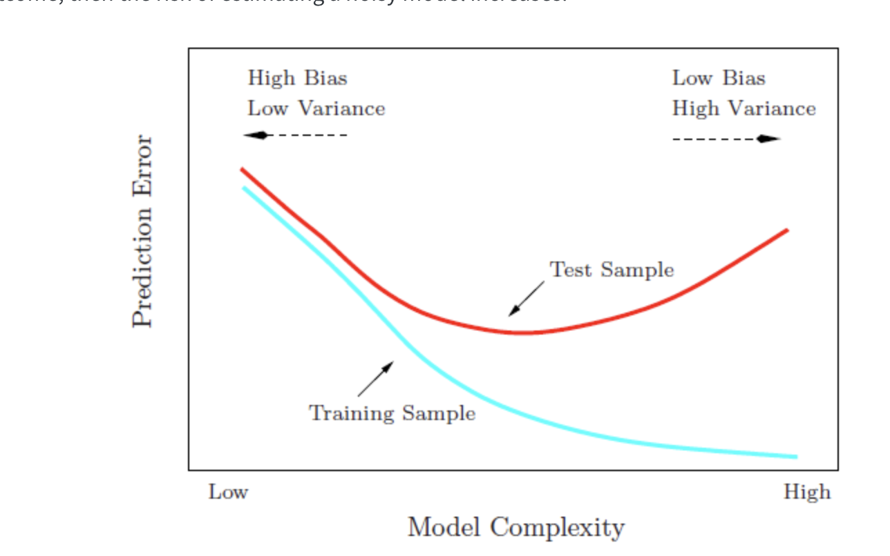

# Classification I: K-Nearest Neighbors {.unnumbered}

*Week 2, 9 September*

Last week we separated four research goals and left prediction as a promise. This week we keep it. The method we start with, $K$-nearest neighbors, was chosen for one reason above all others: it can be drawn. There is no probability theory to follow, no optimization procedure running out of sight, and no coefficients to interpret. Everything the algorithm does can be seen in a picture, which means that when it goes wrong, you can see that too.

That is worth more at this stage than a method with better performance. You are going to spend the rest of the block working with models whose internals are progressively harder to inspect. It helps to have one case where nothing is hidden.

There is code in this handout, and you should run it rather than read it. The workshop assumes you have.

# Fitting a function without assuming its shape

We usually want to know how an outcome varies with something else: how $Y$ behaves conditional on $X$, written $P(Y=y \mid X=x)$.

The most familiar strategy is to assume a shape for that relationship and then estimate the parameters of the assumed shape. Ordinary least squares assumes a line. Logit and probit assume particular shapes for binary outcomes. These are **parametric** models, and the assumption is doing a great deal of work.

Assuming a shape buys you real things. You get coefficients you can interpret substantively, standard errors, a compact summary you can put in a table, and a direct connection between a theoretical claim and a quantity you can estimate. Most of what you have done in your other courses relies on this.

It also costs something. If the true relationship is not the shape you assumed, the model is wrong in a way that more data will not fix. Collecting a thousand more observations does not rescue a straight line drawn through a curve.

When the assumption looks doubtful, there are two responses. The first is to stay inside the parametric framework and repair the model: transform a variable, add an interaction, take logarithms. The second is to use a **non-parametric** method, which assumes much less about the shape and lets the data determine it.

$K$-nearest neighbors is the simplest non-parametric method there is. Here is the entire algorithm:

> To predict the outcome for a case, find the $k$ cases in your data most similar to it, and average their outcomes. If the outcome is a category rather than a number, take the majority vote instead of the average.

There is nothing else. No estimation step, no parameters, no fitting in the usual sense. The model is the data.

# Drawing it: development and infant mortality

Last week's running example was the association between economic development and political development, and we stopped at the point where the correlation was clear and the direction of the arrow was not. Set the arrow aside for the moment. We are asking a prediction question now, and prediction does not require us to settle it.

We will use national development indicators for 199 countries, which ship with the `carData` package.

```{r, eval=FALSE}
install.packages(c("carData", "kknn", "caret", "scatterplot3d"))
```

```{r, message=FALSE, warning=FALSE}
library(carData)
library(kknn)

data(UN, package = "carData")

countries <- na.omit(UN[, c("ppgdp", "infantMortality", "fertility",
                            "pctUrban", "lifeExpF", "group")])

nrow(countries)
head(countries)
```

`ppgdp` is per capita gross domestic product in US dollars, and `infantMortality` is deaths per thousand live births. Start by looking at them.

```{r}
plot(countries$ppgdp, countries$infantMortality,
     col = "gray45", pch = 19, cex = 0.7,
     xlab = "Per capita GDP (US$)",
     ylab = "Infant mortality (per 1,000 live births)")
```

The shape is the point. Infant mortality falls very steeply across the poorest range and then flattens out almost completely. The difference between a country at \$500 and a country at \$2,000 is enormous. The difference between \$30,000 and \$40,000 is close to nothing.

Now put a straight line through it.

```{r}
plot(countries$ppgdp, countries$infantMortality,
     col = "gray45", pch = 19, cex = 0.7,
     xlab = "Per capita GDP (US$)",
     ylab = "Infant mortality (per 1,000 live births)")

fit_ols <- lm(infantMortality ~ ppgdp, data = countries)
abline(fit_ols, col = "navy", lwd = 2.5)
```

The line is not a small approximation to the truth here. It is systematically wrong in a patterned way: too low for the poorest countries, too high through the middle, and it eventually predicts negative infant mortality, which is not a quantity that exists.

You could repair this without leaving the parametric framework, and in a paper you probably would. Taking the logarithm of per capita GDP would straighten most of the curve, and that transformation has a defensible substantive reading: what matters for infant mortality is proportional differences in income, not absolute ones. That is a real modeling decision and a good one.

The point of this week is that $K$-nearest neighbors requires no such decision. It does not need to be told the shape.

```{r}
grid <- data.frame(ppgdp = sort(countries$ppgdp))

fit_15 <- kknn(infantMortality ~ ppgdp,
               train = countries, test = grid,
               k = 15, kernel = "rectangular")

plot(countries$ppgdp, countries$infantMortality,
     col = "gray45", pch = 19, cex = 0.7,
     xlab = "Per capita GDP (US$)",
     ylab = "Infant mortality (per 1,000 live births)",
     main = "k = 15")

lines(grid$ppgdp, fit_15$fitted.values, col = "maroon", lwd = 3)
```

The argument `kernel = "rectangular"` means that all $k$ neighbors count equally. Other choices give closer neighbors more weight. Rectangular is the plain version of the algorithm, and it is the one described above.

## What the algorithm actually did

Take one point on that curve. To produce a prediction for a country with a per capita GDP of \$2,000, the algorithm found the fifteen countries in the data closest to \$2,000 on that axis and averaged their infant mortality. To produce the prediction at \$3,000, it did the same thing with a neighborhood that had shifted slightly to the right, dropping some countries and picking up others.

The curve is the trace left behind by that moving neighborhood. It is not a formula, and it cannot be written as one. It is a record of what the neighbors did.

This is also why the curve wobbles where the data are sparse. On the right-hand side there are few countries, so the fifteen nearest neighbors of a rich country may be spread across a very wide range of incomes. The algorithm still returns an answer. It does not warn you that the answer came from a neighborhood stretching across \$40,000.

# The choice of k

Nothing so far told us to use fifteen. Try several values.

```{r}
plot(countries$ppgdp, countries$infantMortality,
     col = "gray75", pch = 19, cex = 0.7,
     xlab = "Per capita GDP (US$)",
     ylab = "Infant mortality (per 1,000 live births)",
     main = "The same data, four values of k")

kvals  <- c(3, 15, 50, 150)
kcols  <- c("darkred", "maroon", "navy", "darkgreen")

for (i in seq_along(kvals)) {
  f <- kknn(infantMortality ~ ppgdp,
            train = countries, test = grid,
            k = kvals[i], kernel = "rectangular")
  lines(grid$ppgdp, f$fitted.values, col = kcols[i], lwd = 2.5)
}

legend("topright", legend = paste("k =", kvals),
       col = kcols, lwd = 2.5, box.lty = 0, cex = 0.8)
```

At $k=3$ the curve is jagged. It follows every local fluctuation, including fluctuations produced by the fact that we happen to have these 199 countries rather than some other set. At $k=150$ the curve is nearly flat, close to the overall average, and it has erased a difference between rich and poor countries that is obviously real.

Both failures are informative, and they are opposite failures.

A small $k$ takes every wiggle in the data seriously. Some of those wiggles are the relationship we want. Others are noise. A model flexible enough to reproduce the training data exactly has reproduced the noise along with the signal, and the noise will not be there next time.

We can state this in one line. Write the outcome as

$$Y = \underbrace{f(X)}_{\text{signal}} + \underbrace{\varepsilon}_{\text{noise}}$$

What we want is $f$. The term $\varepsilon$ is whatever is left over: measurement error, idiosyncrasy, the particular history of the particular countries in this dataset. It is not a stable feature of the world, and a model that has learned it has learned something that will not recur.

So here is the sentence to take away from this week. **A model that fits your data perfectly has told you nothing, because all it has done is recite back the data you already had.** This is the opposite of the instinct most people arrive with, which is that a closer fit is a better model.

A large $k$ fails in the other direction. It averages across countries that are not comparable, and it produces a model too rigid to represent a relationship that genuinely exists.

# Why a perfect fit should worry you

To choose between these we need to stop grading the model on the data it was built from. Split the data in two: fit on one part, evaluate on the other.

```{r}
set.seed(7)

n        <- nrow(countries)
train_id <- sample(1:n, floor(0.7 * n))

Train <- countries[train_id, ]
Test  <- countries[-train_id, ]

nrow(Train)
nrow(Test)
```

`set.seed()` fixes the random draw so that you and I get the same split. Use it every time you do anything random. Without it your results change on every run and neither you nor anyone else can reproduce them.

Now measure the error. For a continuous outcome the usual summary is the root mean squared error,

$$\text{RMSE} = \sqrt{\frac{1}{n}\sum_{i=1}^{n}\left[y_i - \hat{f}(x_i)\right]^2},$$

which is roughly the size of a typical prediction error, in the units of the outcome. Here that means deaths per thousand live births, so an RMSE of 15 means the model is typically off by about fifteen deaths per thousand.

```{r}
rmse <- function(y, yhat) sqrt(mean((y - yhat)^2))

kseq     <- 2:60
err_test <- rep(NA, length(kseq))
err_train <- rep(NA, length(kseq))

for (i in seq_along(kseq)) {
  f_test <- kknn(infantMortality ~ ppgdp, Train, Test,
                 k = kseq[i], kernel = "rectangular")
  err_test[i] <- rmse(Test$infantMortality, f_test$fitted.values)

  f_train <- kknn(infantMortality ~ ppgdp, Train, Train,
                  k = kseq[i], kernel = "rectangular")
  err_train[i] <- rmse(Train$infantMortality, f_train$fitted.values)
}

plot(kseq, err_test, type = "l", col = "maroon", lwd = 2.5,
     ylim = range(c(err_test, err_train)),
     xlab = "k", ylab = "RMSE",
     main = "Error on data the model has seen, and data it has not")

lines(kseq, err_train, col = "navy", lwd = 2.5)

legend("bottomright", legend = c("Test (unseen)", "Training (seen)"),
       col = c("maroon", "navy"), lwd = 2.5, box.lty = 0, cex = 0.8)

kseq[which.min(err_test)]
```

Read the two curves against each other, because the comparison is the lesson.

The training error keeps falling as $k$ gets smaller. It is lowest at the far left, where the model is most flexible. If you had only this curve, you would conclude that the best model is the most complicated one available, and you would conclude that every single time, on every dataset, regardless of the truth.

The test error does something different. It falls, reaches a minimum, and then rises again. Past that minimum the model is no longer learning the relationship. It is learning the training countries.

One caution before you go looking for the best $k$. Change the seed and rerun the code. The U shape will still be there; the exact location of the minimum will move. The shape is a property of the problem. The precise minimum is a property of one arbitrary split. Do not report "the optimal $k$ is 11" as though you had discovered something about infant mortality. We will fix this properly in a moment.

## The same picture, drawn the conventional way

That plot has an awkward feature: its horizontal axis runs backwards. A large $k$ is a *simple* model, so complexity increases as you move to the *left*, which is the opposite of how you will see this drawn everywhere else.

The usual fix is to plot against $\log(1/k)$, which increases as the model gets more flexible.

```{r}
plot(log(1 / kseq), err_test, type = "l", col = "maroon", lwd = 2.5,
     ylim = range(c(err_test, err_train)),
     xlab = "Model complexity, log(1/k)", ylab = "RMSE",
     main = "Complexity increases to the right")

lines(log(1 / kseq), err_train, col = "navy", lwd = 2.5)

text(log(1 / 60), err_test[length(kseq)], "k = 60", pos = 4, cex = 0.8, col = "gray30")
text(log(1 / 2),  err_test[1],            "k = 2",  pos = 2, cex = 0.8, col = "gray30")

legend("top", legend = c("Test (unseen)", "Training (seen)"),
       col = c("maroon", "navy"), lwd = 2.5, box.lty = 0, cex = 0.8)
```

Identical numbers, identical conclusion, drawn so that "further right" means "more flexible model." Every version of this figure you meet from now on, in any textbook and for any method, has this orientation, and the two curves always behave this way: the training curve slides downward forever, and the test curve turns around.

# Bias and variance

We now have the picture. The vocabulary for it is worth learning, because it is how everyone else in this literature talks, and because the two failures it names are genuinely different failures.

Return to the decomposition from earlier:

$$Y = \underbrace{f(X)}_{\text{signal}} + \underbrace{\varepsilon}_{\text{noise}}$$

A model can be wrong about $f$ in two ways.

**Bias** is systematic error. The model is too rigid to represent the shape of $f$, so it is wrong in the same direction every time, and it would still be wrong if you handed it a million more countries. The straight line we drew through the infant mortality data has high bias. So does $K$-nearest neighbors at $k=150$, which flattens a real curve into something close to a horizontal line.

**Variance** is instability. The model is flexible enough to represent $f$, but it responds so eagerly to the particular cases in front of it that a different sample would have produced a noticeably different answer. It is not systematically wrong. It is just not reliable, and the specific answer you got is partly an accident of the data you happen to hold.

The trade-off is that reducing one usually increases the other, which is what produces the U.



This is a schematic, not a fit to anything. It is the shape you just produced from real data, and the shape you will produce from almost any dataset with almost any flexible method.

Read the two arrows at the top. Moving left, the model gets simpler: variance falls, bias rises, and eventually the model is too rigid to represent what is there. Moving right, the model gets more flexible: bias falls, variance rises, and eventually the model is chasing noise. The training curve slides downward the whole way and never turns, which is why it cannot be used to choose anything. The test curve has a minimum, and finding it is the entire problem.

## Seeing variance directly

Bias and variance are hard to separate with real data, for a simple reason: you would need to know the true $f$ in order to say how far the model sits from it, and if you knew $f$ you would not be modeling.

So we simulate. We invent a function, add noise to it, draw many samples from it, and fit a model to each. Because we wrote down the truth ourselves, we can measure exactly how far off each fit lands.

```{r, fig.height=7, fig.width=10}
set.seed(1364)

N <- 1000
x <- rnorm(N, 2, 1)
f_true <- function(x) cospi(x)
y <- f_true(x) + rnorm(N, 0, 0.5)

sim   <- data.frame(x, y)
grid2 <- data.frame(x = sort(x))

kvec   <- c(5, 40, 150)
nsim   <- 30
ntrain <- 200
spot   <- 400                       # one x value we will watch closely
x_spot <- grid2$x[spot]

par(mfrow = c(2, 3))

preds <- matrix(NA, nsim, length(kvec))

for (j in seq_along(kvec)) {

  plot(x, y, col = "gray70", pch = 1, cex = 0.5,
       main = paste("k =", kvec[j]), font.main = 1)

  for (i in 1:nsim) {
    draw <- sim[sample(1:N, ntrain), ]
    f    <- kknn(y ~ x, draw, grid2, k = kvec[j], kernel = "rectangular")
    lines(grid2$x, f$fitted.values, col = "royalblue2", lwd = 0.4)
    preds[i, j] <- f$fitted.values[spot]
  }

  abline(v = x_spot, col = "gray40", lty = 2)
}

for (j in seq_along(kvec)) {
  boxplot(preds[, j], ylim = range(preds), col = "gray90",
          main = paste("Predictions at one point, k =", kvec[j]),
          font.main = 1, cex.main = 0.9)
  abline(h = f_true(x_spot), col = "red", lwd = 2)
}
```

Thirty samples, three values of $k$, and the same underlying truth throughout. The red line in the lower row marks the correct answer at the point we are watching.

At $k=5$ the fitted curves scatter all over the plot. Each one is chasing its own two hundred observations. The predictions center roughly on the truth, so the bias is small, but any single one of them could be well off. That is variance.

At $k=150$ the curves lie almost on top of one another. Run the study again and you would get essentially the same answer, which sounds like a virtue until you notice where that answer sits: the box is nowhere near the red line. The model is stable and consistently wrong. That is bias.

At $k=40$ the box is both reasonably tight and reasonably close. That is the whole idea.

Notice what this means for how you read a result. A model with high variance can be badly wrong without giving any sign of it, because the fit to the data in front of you looks excellent. Nothing in the output announces that a different sample would have said something else.

# Cross-validation

Now back to the problem we left hanging. We chose $k$ using one train and test split, and the choice moved when the seed moved. Two complaints about the single split, both fair:

1. The answer depends on which split we happened to draw, which is exactly the instability we just spent a section learning to distrust.
2. We set aside thirty percent of the countries and never trained on them. With 199 cases that is a real loss of information.

**Cross-validation** addresses both by rotating the role of the held-out set.

## Leave-one-out

Set aside a single observation, train on the remaining $n-1$, predict the one you left out, and record the error. Do it again with the next observation. Repeat $n$ times and average.

$$\text{RMSE}_{\text{LOO}} = \sqrt{\frac{1}{n}\sum_{i=1}^{n}\left(y_i - \hat{y}_i\right)^2}$$

Every case gets used for training almost every time and for testing exactly once. Nothing is wasted, and there is no arbitrary split to be at the mercy of. The cost is that you have to fit the model $n$ times.

## k-fold

The practical compromise is to hold out a group instead of a single case. Split the data at random into a number of roughly equal folds. Hold out the first fold, train on the rest, and record the error on the fold you held out. Then hold out the second fold, and so on, until every fold has served once as the test set. Average the results.

```{r, echo=FALSE, fig.height=4.5}
nf <- 5

plot(NULL, xlim = c(0, 11), ylim = c(0, nf + 1.4),
     axes = FALSE, xlab = "", ylab = "",
     main = "5-fold cross-validation", font.main = 1)

for (row in 1:nf) {
  ypos <- nf - row + 1
  for (col in 1:nf) {
    held <- (col == row)
    rect(col * 1.6, ypos - 0.32, col * 1.6 + 1.5, ypos + 0.32,
         col = if (held) "gray55" else "white", border = "gray25")
  }
  text(1.4, ypos, paste("Round", row), pos = 2, cex = 0.85)
  text(nf * 1.6 + 1.9, ypos, bquote(E[.(row)]), pos = 4, cex = 0.9)
}

text(5.6, nf + 1.0, "each block is one fold of the data", cex = 0.85, col = "gray30")
legend("bottom", legend = c("trained on", "held out and tested on"),
       fill = c("white", "gray55"), border = "gray25",
       box.lty = 0, cex = 0.85, horiz = TRUE)
```

$$\text{CV RMSE} = \sqrt{\frac{1}{\text{nfold}}\sum_{f=1}^{\text{nfold}} \text{MSE}_f}$$

**One warning about names before the code.** The $k$ in "$k$-fold" has nothing whatever to do with the $k$ in "$K$-nearest neighbors." They are two unrelated numbers that unfortunately share a letter, and we are about to choose one of them using the other. To keep them apart, the code below calls the number of folds `nfold` and never `k`.

```{r}
cv_knn <- function(data, kvals, nfold = 10, seed = 7) {

  set.seed(seed)
  fold <- sample(rep(1:nfold, length.out = nrow(data)))
  out  <- rep(NA, length(kvals))

  for (j in seq_along(kvals)) {

    fold_mse <- rep(NA, nfold)

    for (f in 1:nfold) {
      tr  <- data[fold != f, ]
      te  <- data[fold == f, ]
      fit <- kknn(infantMortality ~ ppgdp, tr, te,
                  k = kvals[j], kernel = "rectangular")
      fold_mse[f] <- mean((te$infantMortality - fit$fitted.values)^2)
    }

    out[j] <- sqrt(mean(fold_mse))
  }

  out
}
```

You are not expected to be able to write that from scratch. You are expected to be able to read it and say in words what it does, which is the standard this course applies to code generally.

```{r}
kseq2  <- 2:60

cv_5  <- cv_knn(countries, kseq2, nfold = 5)
cv_10 <- cv_knn(countries, kseq2, nfold = 10)

plot(kseq2, cv_10, type = "l", col = "maroon", lwd = 2.5,
     ylim = range(c(cv_5, cv_10)),
     xlab = "k", ylab = "Cross-validated RMSE",
     main = "Choosing k by cross-validation")

lines(kseq2, cv_5, col = "navyblue", lwd = 2.5)

abline(v = kseq2[which.min(cv_10)], lty = 2, col = "maroon")

legend("topleft", legend = c("10-fold", "5-fold"),
       col = c("maroon", "navyblue"), lwd = 2.5, box.lty = 0, cex = 0.8)

kseq2[which.min(cv_5)]
kseq2[which.min(cv_10)]
```

Compare this curve with the single-split version. It is smoother, because each point averages several held-out sets rather than resting on one, and the two fold counts broadly agree with each other. That agreement is the reassurance we were missing before.

It does not make the choice of $k$ objective. Cross-validation still leaves you with a range of values that perform about equally well, and picking the exact minimum of a flat curve is reading precision into noise. Report the range, say what you chose, and say why.

## The same thing, with caret

Nobody writes that loop in practice. Now that you know what cross-validation does, here is the tool you will actually use for it, and use for the rest of this course.

`caret` is the standard R package for fitting and comparing predictive models through a single interface. It is worth installing now, because Week 6 uses it again for evaluation.

```{r, eval=FALSE}
install.packages("caret")
```

```{r, message=FALSE, warning=FALSE}
library(caret)

set.seed(7)

cv_caret <- train(
  infantMortality ~ ppgdp,
  data       = countries,
  method     = "knn",
  preProcess = c("range"),
  trControl  = trainControl(method = "cv", number = 10),
  tuneGrid   = data.frame(k = kseq2)
)

cv_caret$bestTune

plot(cv_caret)
```

Four arguments carry the work, and each corresponds to something we did by hand.

`method = "knn"` picks the algorithm. `caret` supports well over a hundred, and swapping this one string is how you will fit a random forest next week.

`trControl = trainControl(method = "cv", number = 10)` is the cross-validation. `number` is the fold count, our `nfold`. Set `method = "LOOCV"` here and you get leave-one-out instead.

`tuneGrid = data.frame(k = kseq2)` gives it the values of $k$ to try, the same sequence we looped over. Leave this out and `caret` quietly tries three values of its own choosing, which is almost never what you want.

`preProcess = c("range")` rescales the features to lie between zero and one, which is the first of the two formulas from the previous section. **This is not the default.** Omit it and `caret` uses the raw units.

One honest caveat about that last point here. With a single predictor, rescaling makes no difference at all: stretching one axis cannot change which countries are nearest to which. It is in the argument above because it becomes essential the moment we add a second feature, and because a habit formed on the easy case is one you still have on the hard one.

The answer should land close to what the loop produced, though not necessarily identical, since `caret` draws its own folds. If the two disagree by more than a few units of $k$ on a curve this flat, that is the flatness talking rather than a real disagreement.

Week 6 returns to evaluation and takes it further, into the metrics that matter when the outcome is rare and accuracy stops being informative.

# More than one feature, and the problem of units

So far similarity has meant closeness on a single axis, which is easy. With several features we need a general definition of distance, and the usual one is Euclidean distance. For a case $f$ with features $(x_{f1}, \dots, x_{fp})$ and a case $i$ in the training data,

$$d_{if} = \sqrt{\sum_{j=1}^{p}\left(x_{fj} - x_{ij}\right)^2}.$$

This is the straight-line distance you already know, extended to more than two dimensions. And it introduces a problem that is easy to miss and consequential when you do.

Our features are measured in wildly different units. Per capita GDP runs into the tens of thousands of dollars. Percent urban runs from zero to a hundred. Fertility runs from about one to about seven.

```{r}
summary(countries[, c("ppgdp", "pctUrban", "fertility", "lifeExpF")])
```

Put those into the distance formula unchanged and a difference of \$10,000 in income contributes a hundred million to the sum under the square root, while the entire possible range of fertility contributes about thirty-six. Income does not merely dominate the calculation. It effectively is the calculation, and the other three features have no influence on which cases count as neighbors.

The standard fix is to put all features on a common scale first, either

$$\tilde{x} = \frac{x - \min(x)}{\max(x) - \min(x)} \qquad \text{or} \qquad \tilde{x} = \frac{x - \bar{x}}{\sigma_x}.$$

```{r}
rescale <- function(x) (x - min(x)) / (max(x) - min(x))

feats <- c("ppgdp", "pctUrban", "fertility", "lifeExpF")

countries_s <- countries
countries_s[feats] <- lapply(countries_s[feats], rescale)

summary(countries_s[, feats])
```

The first thing to establish is that this is a harmless operation. Rescaling does not change the relationship between any feature and the outcome. Look at two features before and after.

```{r, fig.height=8, fig.width=9}
par(mfrow = c(2, 2))

plot(countries$ppgdp, countries$infantMortality, col = "maroon", cex = 0.7,
     xlab = "Per capita GDP (US$)", ylab = "Infant mortality",
     main = "Raw units", font.main = 1)

plot(countries_s$ppgdp, countries_s$infantMortality, col = "maroon", cex = 0.7,
     xlab = "Per capita GDP (rescaled 0 to 1)", ylab = "Infant mortality",
     main = "Rescaled", font.main = 1)

plot(countries$pctUrban, countries$infantMortality, col = "maroon", cex = 0.7,
     xlab = "Percent urban", ylab = "Infant mortality",
     main = "Raw units", font.main = 1)

plot(countries_s$pctUrban, countries_s$infantMortality, col = "maroon", cex = 0.7,
     xlab = "Percent urban (rescaled 0 to 1)", ylab = "Infant mortality",
     main = "Rescaled", font.main = 1)
```

The clouds of points are identical in shape. Only the numbers on the horizontal axis have moved. Nothing about the association between any feature and the outcome has been altered.

What has changed is invisible in these plots, because it is not about any single feature. It is about the space the features jointly define.

## What the algorithm now sees

With two features rather than one, cases no longer sit along a line. They sit in a plane, and the outcome rises above it.

```{r, fig.height=7, fig.width=7}
library(scatterplot3d)

scatterplot3d(countries_s$ppgdp, countries_s$pctUrban, countries_s$infantMortality,
              color = "maroon", pch = 1, cex.symbols = 0.7,
              xlab = "Per capita GDP (rescaled)",
              ylab = "Percent urban (rescaled)",
              zlab = "Infant mortality")
```

Add a third feature and the picture cannot be drawn at all, which is the last point in this course at which you can see the space a model is working in. From Week 3 onward you will have to reason about it rather than look at it. The arithmetic does not care: the distance formula extends to any number of features without complaint, and it is only our eyes that stop at three.

## What the neighborhood looks like

Now the thing worth seeing. Pick a country, and ask which twenty-five countries the algorithm considers its neighbors. We do it twice, once in raw units and once rescaled, using the same country both times.

```{r, fig.height=6, fig.width=11}
target_raw <- c(median(countries$ppgdp),   median(countries$pctUrban))
target_s   <- c(median(countries_s$ppgdp), median(countries_s$pctUrban))

# Euclidean distance, exactly the formula above, computed by hand
dist_raw <- sqrt((countries$ppgdp   - target_raw[1])^2 +
                 (countries$pctUrban - target_raw[2])^2)

dist_s   <- sqrt((countries_s$ppgdp   - target_s[1])^2 +
                 (countries_s$pctUrban - target_s[2])^2)

nb_raw <- order(dist_raw)[1:25]
nb_s   <- order(dist_s)[1:25]

par(mfrow = c(1, 2))

plot(countries$ppgdp, countries$pctUrban, col = "gray55", pch = 19, cex = 0.7,
     xlab = "Per capita GDP (US$)", ylab = "Percent urban",
     main = "Raw units, k = 25", font.main = 1)
points(countries$ppgdp[nb_raw], countries$pctUrban[nb_raw], col = "red", cex = 1.6)
points(target_raw[1], target_raw[2], col = "red", pch = 19, cex = 1.7)
abline(v = target_raw[1], h = target_raw[2], col = "darkgreen", lty = 2)

plot(countries_s$ppgdp, countries_s$pctUrban, col = "gray55", pch = 19, cex = 0.7,
     xlab = "Per capita GDP (rescaled)", ylab = "Percent urban (rescaled)",
     main = "Rescaled, k = 25", font.main = 1)
points(countries_s$ppgdp[nb_s], countries_s$pctUrban[nb_s], col = "red", cex = 1.6)
points(target_s[1], target_s[2], col = "red", pch = 19, cex = 1.7)
abline(v = target_s[1], h = target_s[2], col = "darkgreen", lty = 2)
```

The filled red point is the country we are predicting for. The circled points are the twenty-five the algorithm chose as most similar to it.

On the right, with both features on a common scale, the neighborhood is roughly a disc around the target. Both features contributed to picking it, which is what we asked for.

On the left it is a narrow vertical band. The selected countries share almost exactly the target's income and are spread across nearly the whole range of urbanization, from barely urban to almost entirely so. In raw units, per capita GDP runs into the tens of thousands and percent urban tops out at a hundred, so a difference of a few thousand dollars swamps the entire possible range of the second feature. The algorithm did not ignore urbanization because anybody decided it was unimportant. It ignored it because of the units it was measured in.

Note also what the model would have reported. Both versions return predictions. Neither prints a warning. The left-hand model would have gone into a paper as a two-feature model, and the fact that it was a one-feature model in disguise would appear nowhere in the output.

Stay with that, because it is not a technical footnote. The algorithm's entire operation rests on its definition of "similar," and that definition was just set by two choices: which features we included, and how we scaled them. Neither choice required anyone to make a claim about the world. Had we left the units alone, the model would have decided that countries are similar when their incomes are similar, and it would have reported that decision as a finding rather than as an artifact of the fact that GDP happens to be counted in dollars.

# From averaging to voting

Everything so far predicted a number. Now predict a category, which is the same algorithm with the average replaced by a vote.

Our outcome is whether a country belongs to the OECD, which the data record in `group`.

```{r}
countries_s$oecd <- factor(ifelse(countries_s$group == "oecd", "OECD", "Not OECD"),
                    levels = c("Not OECD", "OECD"))

table(countries_s$oecd)
```

This is a genuinely political outcome and not a manufactured one. OECD membership is a fact about which states belong to a particular club of wealthy democracies, arrived at through a real accession process. The question we are asking is whether a country's development indicators are enough to tell you whether it is in that club.

```{r}
set.seed(7)

n_s      <- nrow(countries_s)
train_id <- sample(1:n_s, floor(0.7 * n_s))

Train_s <- countries_s[train_id, ]
Test_s  <- countries_s[-train_id, ]

fit_class <- kknn(oecd ~ ppgdp + pctUrban + fertility + lifeExpF,
                  train = Train_s, test = Test_s,
                  k = 7, kernel = "rectangular")

pred <- fitted(fit_class)
```

Among the seven nearest neighbors of each test country, the algorithm counted how many were OECD members and assigned whichever label won.

# Reading a confusion matrix

Do not go straight to a single accuracy number. Look at the table first.

```{r}
cm <- table(Predicted = pred, Actual = Test_s$oecd)
cm
```

Four cells, and they are not interchangeable. Naming them requires first choosing which class counts as **positive**, which is a decision you make and not a property of the data. Here we will call OECD membership positive.

| | Actually OECD | Actually not OECD |
|---|---|---|
| **Predicted OECD** | True positive | False positive |
| **Predicted not OECD** | False negative | True negative |

A **false positive** is a country the model puts in the club that is not in it. A **false negative** is a member the model fails to recognize. These are different mistakes, and in almost every real application one of them costs more than the other. A screening test that misses a disease and a screening test that raises a false alarm fail in ways that are not remotely comparable, even when they are wrong equally often.

Accuracy is the two correct cells over the total.

```{r}
accuracy <- sum(diag(cm)) / sum(cm)
accuracy
```

# The baseline that is hard to beat

Now the part that matters most this week, and the part most often skipped.

Before you can say whether that accuracy is good, you have to know what you would have achieved with no model at all. The dumbest possible rule here is to predict "Not OECD" for every country in the world, without looking at any data.

```{r}
baseline <- mean(Test_s$oecd == "Not OECD")
baseline
```

Compare the two numbers. Most countries are not OECD members, so the rule that ignores everything already scores very highly, and whatever the model achieved has to be read against that figure rather than against zero.

This is why an accuracy figure reported on its own tells you almost nothing. It is not a small technical caveat. It is the single most common way that a model with no useful content gets presented as a success, and you will encounter it in published research, in vendor documentation, and in news coverage of deployed systems. When a system is described as "95 percent accurate," the first question is always: accurate compared to what, and how rare is the thing it is looking for?

Week 6 develops this properly and introduces precision, recall, and the metrics that survive rare outcomes. For now the rule is simple and you should apply it from this week onward without being asked: **always compute the baseline, and always report it next to the accuracy.**

# What this model cannot tell you

The classifier has no coefficients. There is no number to report saying how much per capita GDP matters, no standard error, no statement of the form "a one-unit increase in $X$ is associated with a change in $Y$." The model cannot be written down apart from the data it holds.

More importantly, it has said nothing about why any country is in the OECD. It has found that member states resemble each other on these indicators and differ from non-members. That is a prediction, in exactly the sense we distinguished last week, and it does not become an explanation by performing well.

There is one further observation worth making, because it is not a quirk of this example. Our model never saw the variable `group`. It was given income, urbanization, fertility, and life expectancy, and it recovered club membership from them anyway, because those features carry the information. Removing an attribute from a model does not remove it from the model's reach if the remaining features encode it. This is the ordinary mechanism by which systems built to be neutral about some characteristic turn out not to be, and it will return in Week 7 when we look at how deployed systems are audited and defended.

# The politics of similarity

The rule at the center of this week is that cases similar to past cases receive what those past cases received.

That is also a fair description of precedent in law, of case-based reasoning in administration, and of the Weberian bureaucratic ideal we discussed last week, in which similar cases are treated alike regardless of who happens to be at the desk. Consistency of this kind is not a defect. It is one of the oldest arguments for rule-bound government, and part of what makes an administration predictable enough to be held to account.

What changes when the rule is a fitted model is who defines similarity, and how visibly. In $K$-nearest neighbors that definition came from feature selection and rescaling, decisions made early, made quietly, and almost never revisited or documented once the system is running. Nobody writes them down as a policy, because they do not look like a policy.

And a model of this kind can only reproduce the pattern in the cases it was given. If the treatment recorded in those cases was unjust, then similarity to past cases carries the injustice forward, and it does so with the appearance of perfect consistency. The system is not malfunctioning when this happens. It is doing precisely what it was built to do.

# Reading

James, G., Witten, D., Hastie, T., and Tibshirani, R. *An Introduction to Statistical Learning*. Sections 2.1 and 2.2, Section 3.5, and Section 5.1. Freely available at [statlearning.com](https://www.statlearning.com/) [@james2021].

Read Section 2.2 for the figures rather than the derivations. The pictures of training error against test error, and of the bias-variance decomposition, are the same pictures you produced above, and seeing them drawn by someone else is a useful check on whether you understood what you made. Section 5.1 covers cross-validation and is short.

# Before the workshop

Install `carData`, `kknn`, `caret`, and `scatterplot3d`, run every chunk in this handout once, and bring a charged laptop. The workshop begins from the assumption that the code above ran on your machine, and the first part of a three-hour session is not the place to discover an installation problem.

If something failed, say so at the start rather than at the end.

# Questions for the session

Come with a view on at least two of these. They will structure the first part of the session.

1. $K$-nearest neighbors has no coefficients and makes no claim about mechanism. Is it therefore useless for political science, or is that the wrong test to apply to it? Last week's reading is relevant here.

2. The choice of $k$ has no correct answer that can be read off the data alone. What does it mean that a central decision in a model is made by the researcher rather than discovered?

3. We rescaled the features so that income would not dominate the distance calculation. Suppose someone had not. Would you describe the resulting model as wrong, or as encoding a particular view of what makes two countries similar? Does the distinction matter for how such a system should be reviewed?

4. Our classifier recovered OECD membership without ever being shown it. What follows for the common proposal that a system can be made fair by removing a sensitive attribute from its inputs?

5. A model reports 95 percent accuracy on a task where the outcome occurs in 4 percent of cases. What do you now know, and what would you need to ask before believing anything about its usefulness?

6. Bureaucratic rule-following and nearest-neighbor prediction both treat like cases alike. Identify one political difference between them that is not simply that the model is more complicated.