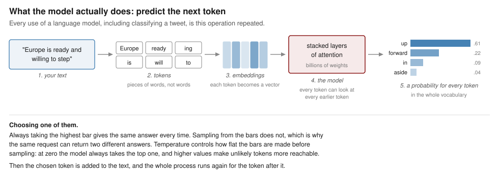
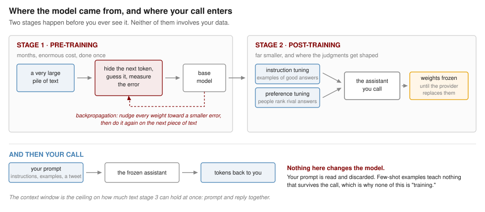

# Large Language Models

*Week 5, 30 September*

Three weeks of this course have now been spent on a single arrangement. Somebody decides what the categories are, somebody labels a few hundred documents by hand, and an algorithm learns to reproduce those labels on documents it has not seen. Week 2 did it with neighbors, Week 3 with trees, and Week 4 with word rates. The algorithms differ considerably and the arrangement does not differ at all.

This week concerns two ways of departing from that arrangement, and they depart in opposite directions.

The first gives up the categories. If you do not know in advance what distinctions are present in a corpus, you can ask a model to propose some, and then decide whether the groupings it returns correspond to anything you care about. The categories arrive from the data rather than from you, which sounds like an escape from the coding problem and turns out to relocate it rather than dissolve it.

The second gives up the labeled examples. Large language models can be told what the categories are in ordinary English and asked to apply them, with no training data whatever. That sounds like an escape from the labeling problem, and the rest of the session concerns what it actually costs.

## Part I. Categories you did not supply

### Supervised and unsupervised

Everything so far has been **supervised**, in the specific sense that the training data carried an answer for every case. The model's task was to find a rule that reproduced those answers, and its success could be measured by how often it did.

**Unsupervised** methods have no answers to reproduce. Given a corpus and nothing else, they look for structure: documents that resemble one another, words that travel together. There is no accuracy figure at the end because there is nothing to be accurate about, and this is the fundamental difference between the two families rather than a gap in the software.

The most widely used unsupervised method for text in political science is the **topic model**, and the standard version is Latent Dirichlet Allocation. The idea is that each document is a mixture of a small number of topics, and each topic is a distribution over words. Fitting the model means recovering both at once: which words constitute each topic, and how much of each topic is in each document.

Because there is no accuracy figure, there is also no alarm that sounds when the method has nothing to work with. The first thing we do with it, therefore, is break it.

### The corpus, and a subset of it

```{r, eval=FALSE}
install.packages(c("tm", "SnowballC", "topicmodels", "slam", "ggplot2"))
```

```{r, message=FALSE, warning=FALSE}
library(tm)
library(SnowballC)
library(topicmodels)
library(slam)
library(ggplot2)

url <- paste0("https://raw.githubusercontent.com/babakrezaee/",
              "AppliedAI-PoliSci/refs/heads/main/data/",
              "trump_2019_all.csv")

all <- read.csv(url, stringsAsFactors = FALSE, na.strings = "")

nrow(all)

table(all$label, useNA = "ifany")
```

This is every original tweet posted in 2019, after the same cleaning that produced last week's file: retweets removed, link-only tweets removed, duplicates removed. Last week's 905 tweets are a **subset** of this one, and the `label` column marks them. The other three thousand were never hand-coded.

Cleaning is exactly the Week 4 pipeline, so nothing in it is new.

```{r, message=FALSE, warning=FALSE}
corpus <- VCorpus(VectorSource(all$text))

replace_with_space <- content_transformer(function(x, pattern) {
  gsub(pattern, " ", x)
})

clean <- tm_map(corpus, content_transformer(tolower))
clean <- tm_map(clean, replace_with_space, "http[s]?://\\S*")
clean <- tm_map(clean, replace_with_space, "@\\S+")
clean <- tm_map(clean, replace_with_space, "[^a-z ]")
clean <- tm_map(clean, removeWords, stopwords("english"))
clean <- tm_map(clean, stemDocument)
clean <- tm_map(clean, stripWhitespace)

dtm <- DocumentTermMatrix(clean)

dtm
```

One obstacle arrives before the model does. A few tweets are almost entirely links and handles, so after cleaning they contain no words at all, and a row of zeros is not a mixture of topics. `LDA()` refuses to fit while such rows are present, and the error message does not explain itself.

```{r}
keep <- row_sums(dtm) > 0

sum(!keep)
```

### A first attempt, on last week's corpus

Start with the corpus you already know, the 905 hand-labeled tweets.

```{r}
wk4 <- which(!is.na(all$label) & keep)

length(wk4)

lda_wk4 <- LDA(dtm[wk4, ], k = 6, control = list(seed = 7))

terms(lda_wk4, 10)
```

Look at the six columns before reading on, and try to name them.

You will not be able to. Every column contains `border`, or `wall`, or both, along with `will`, `great`, `democrat`, and `presid`. There are six topics and they are the same topic. Nothing failed, no warning appeared, and the output has exactly the shape the textbook says it should have.

### Why, and what that tells you

The model is not broken. It is reporting, accurately, that this corpus is about one thing.

```{r}
probe <- as.matrix(dtm[, c("border", "wall", "mexico")]) > 0

round(100 * colMeans(probe[wk4, ]), 1)

round(100 * colMeans(probe[keep, ]), 1)
```

In last week's corpus, `border` is in roughly three tweets in ten. Across the full year it is in fewer than one in ten. That corpus was **built** to be like this: it took every immigration tweet in 2019 and then deliberately filled the negative class with near misses that also say *border*, *wall*, and *illegal*, precisely so that a classifier could not succeed by spotting one word. That construction is what made it a good exercise for Naive Bayes, and it is exactly what makes it useless here.

The general lesson is worth more than the example. **An unsupervised result is a property of the corpus at least as much as of the method.** A supervised model that fails tells you so, in an accuracy figure that sits below the baseline. A topic model that fails returns six neatly formatted columns and leaves the judgment to you. Published topic models are not usually accompanied by the corpus checks that would let a reader make that judgment independently.

### The same model, the whole year

```{r}
lda_all <- LDA(dtm[keep, ], k = 6, control = list(seed = 7))

terms(lda_all, 10)
```

Now the columns differ from one another, because the corpus does. The full year contains the border fight, but also impeachment, the Mueller report, trade with China, the economy, rallies and endorsements.

### Reading the model properly

`terms()` is a convenience. Everything the model estimated is in two matrices, and it is worth taking them out explicitly, because every figure below is built from one or the other.

```{r}
post <- posterior(lda_all)

beta <- post$terms     # 6 topics by vocabulary: word probabilities within a topic
gamma <- post$topics   # documents by 6 topics: topic shares within a document

dim(beta)

dim(gamma)
```

### The top words in each topic

```{r, fig.height=7, fig.width=9}
top <- data.frame()

for (k in 1:6) {
  o <- order(beta[k, ], decreasing = TRUE)[1:10]
  top <- rbind(top, data.frame(topic = k,
                               term  = colnames(beta)[o],
                               beta  = beta[k, o]))
}

top$lab <- factor(paste(top$topic, top$term),
                  levels = rev(paste(top$topic, top$term)))

ggplot(top, aes(beta, lab)) +
  geom_col(fill = "steelblue") +
  facet_wrap(~ topic, scales = "free_y") +
  scale_y_discrete(labels = function(x) sub("^[0-9]+ ", "", x)) +
  labs(x = "probability of the word within the topic", y = NULL,
       title = "Most probable words in each topic")
```

This is the same information `terms()` printed, with the probabilities visible rather than implied, and one thing is immediately clearer in the picture than in the table: within each topic the bars fall away steeply, so a topic is carried by two or three words and the rest are close to noise.

### The words that actually separate the topics

The previous figure has a defect that the failed model made painfully obvious. The most *probable* words in a topic are largely the words that are common everywhere, so `will` and `great` appear near the top of several topics and tell you nothing about any of them.

The fix is to ask a different question. Not which words are likely in this topic, but which words are **more likely here than in the corpus as a whole**.

```{r, fig.height=7, fig.width=9}
p_corpus <- col_sums(dtm[keep, ])
p_corpus <- p_corpus / sum(p_corpus)
p_corpus <- p_corpus[colnames(beta)]

lift <- sweep(log2(beta), 2, log2(p_corpus), "-")

lift[beta < 0.0015] <- NA   # ignore words too rare to be worth reporting

dist <- data.frame()

for (k in 1:6) {
  o <- order(lift[k, ], decreasing = TRUE, na.last = NA)[1:10]
  dist <- rbind(dist, data.frame(topic = k,
                                 term  = colnames(lift)[o],
                                 lift  = lift[k, o]))
}

dist$lab <- factor(paste(dist$topic, dist$term),
                   levels = rev(paste(dist$topic, dist$term)))

ggplot(dist, aes(lift, lab)) +
  geom_col(fill = "maroon") +
  facet_wrap(~ topic, scales = "free_y") +
  scale_y_discrete(labels = function(x) sub("^[0-9]+ ", "", x)) +
  labs(x = "log2 times more likely in this topic than in the corpus", y = NULL,
       title = "Most distinctive words in each topic")
```

A value of 2 means the word is four times more likely inside the topic than in the corpus at large. The shared vocabulary drops out and what is left is what divides the topics.

Two cautions about this figure. The threshold `0.0015` is mine and it is arbitrary: without it the plot fills with words used twice in the entire corpus, which have enormous lift and no meaning. Change it and see. And a word can be distinctive without being important, so this figure and the previous one are worth reading together rather than treating either as the answer.

::: {.callout-tip}
Run the distinctiveness plot on `lda_wk4`, the model that failed. The bars will be short and the words nearly identical across the six panels. This is the figure that would have told you in five seconds what the printed table took a paragraph to explain.
:::

### Documents are mixtures, not members

The model has not sorted tweets into six boxes. It has given every tweet a share of each topic, and the shares sum to one.

```{r, fig.height=5, fig.width=8}
gdf <- data.frame(topic = factor(rep(1:6, each = nrow(gamma))),
                  gamma = as.vector(gamma))

ggplot(gdf, aes(topic, gamma)) +
  geom_boxplot(fill = "grey90", outlier.size = 0.4, outlier.alpha = 0.3) +
  labs(x = "topic", y = "share of a document belonging to this topic",
       title = "How much of each document belongs to each topic")
```

Most tweets are mostly one topic, which is what the long upper tails show, but a substantial number are genuinely split. That is a real difference from every model so far in this course. Naive Bayes assigned each tweet to one class; the tree sent each country down one path. Here a tweet can be sixty percent one thing and forty percent another, which is often a more honest description of a political text and is considerably harder to put in a table.

### Against the hand labels

We have labels for 905 of these tweets, which most applications of a topic model do not. So we can ask a question that is usually unavailable: does any discovered topic correspond to the category a human coder was using?

```{r, fig.height=5, fig.width=7}
lab <- all$label[keep]
assigned <- topics(lda_all)

tab <- table(topic = assigned[!is.na(lab)], label = lab[!is.na(lab)])

hdf <- as.data.frame(prop.table(tab, 2))

ggplot(hdf, aes(label, topic, fill = Freq)) +
  geom_tile(colour = "white") +
  geom_text(aes(label = sprintf("%.0f%%", 100 * Freq)), size = 3.4) +
  scale_fill_gradient(low = "white", high = "steelblue") +
  labs(x = NULL, y = "topic", fill = "share of\ncolumn",
       title = "Where the hand-coded tweets land")
```

Read the figure by column. The immigration tweets concentrate in one or two topics without being confined to them, and those same topics also collect tweets the coder called `other`.

The category and the structure are related without being the same thing, and neither is a corrupted version of the other. They are answers to different questions. The coder asked whether immigration is a main subject of this tweet. LDA asked which words tend to occur together across the corpus, which is a question about the corpus rather than about any category.

### Naming, and what naming costs

You have now looked at four figures, and none of them told you what the topics are. That was always going to be true. LDA returns six numbered distributions over words, and calling topic 3 "immigration" is an act of interpretation performed by a researcher on the basis of ten words.

The coding problem was not removed by going unsupervised. It was moved from before the analysis to after it, and made less visible in the process, because a topic name in a results table looks like a finding in a way that a codebook rule does not.

Two further decisions are equally yours. The number of topics, `k`, was set to six by me, and nothing in the data chose it: fit twenty and the border, the caravan, and the wall may separate into three, none of which is more correct than the single topic that preceded it. And the Week 4 cleaning decisions are still doing their work, since stemming and the stopword list determine which words are available to constitute a topic at all.

That is the honest summary. Topic models are excellent for finding out what is in a corpus you have not read, which is a real and common situation. They do not measure a concept you have defined, and treating a topic as though it were such a measurement is the most common way the method is misused in published work.

## Part II. What a language model is

Before we call one, it is worth knowing roughly what is on the other end. Not the mathematics, which is a course of its own, but enough of the shape of the thing that the behavior we meet later is not surprising.

### One operation, repeated

A language model does one thing: given some text, it produces a probability for every possible next piece of text, and something then picks one.



Four terms in that figure are worth defining, because they recur whenever anybody writes about these systems.

A **token** is the unit the model works in. It is usually a piece of a word rather than a word, so *willing* may arrive as `will` and `ing`, and an unusual name may be split into four pieces. Tokens are also what you are billed for.

An **embedding** is the vector a token is turned into. Words used in similar contexts end up with similar vectors, which is how the model can treat *protest* and *demonstration* as related without anybody writing a rule saying so. This is the same intuition as the distance calculations in Week 2, with the coordinates learned rather than measured.

**Attention** is the mechanism that lets each token's representation be built out of the other tokens around it. It is why *bank* in a sentence about rivers ends up represented differently from *bank* in a sentence about money, and it is the architectural idea that made these models work where earlier ones did not.

The **context window** is how much text the model can hold at once, prompt and answer together. Everything outside it does not exist as far as the model is concerned.

Notice what follows from the figure alone. Classification, summarizing, translation, and writing code are not separate capabilities that were added one at a time. They are all the same operation, prompted differently. When we ask for a sentiment label later, the model is not consulting a sentiment module; it is continuing text in a way that makes a label the plausible next token.

### Where it came from

The model that answers your call went through two stages, and the distinction between them matters for how its judgments should be read.



**Pre-training** is the enormous stage. The model is shown a very large quantity of text, and repeatedly asked to predict a hidden next token. Each time it is wrong, **backpropagation** works out how every one of its billions of weights contributed to the error and nudges each one slightly in the direction that would have reduced it. Repeated across a staggering volume of text, this is how the model acquires grammar, facts, style, and most of what it appears to know. It is also where the model acquires the distribution of the text it was trained on, including which voices are abundant in it and which are rare.

The result is a **base model**, which predicts plausible continuations and is not yet useful to talk to, because the plausible continuation of a question is often another question.

**Post-training** is much smaller and does the shaping. In instruction tuning, the model is trained on examples of instructions paired with good responses. In preference tuning, people are shown rival answers and asked which is better, and the model is adjusted toward the preferred ones. This is the stage that makes it an assistant, and it is also the stage at which somebody's judgment about what counts as a good, safe, or appropriate answer is built into the weights. When the model calls a tweet "critical" rather than "diplomatic," both stages are speaking.

### Nothing you do changes it

By the time you make a call, the weights are fixed. Your prompt is read, an answer is produced, and nothing persists.

This is why the earlier claim holds that our few-shot examples are not training. The model does not learn from them; it reads them in the same breath as the tweet, treats them as context, and forgets them when the call ends. It is the difference between teaching somebody and handing them a note.

Two consequences follow immediately, and both will matter later. Your data is not used to fit anything, but it is transmitted to and processed by somebody else's system, which is a separate question with its own answer in the provider's terms. And the version of the model you are calling can be replaced by its owner at any time, which is why a measurement taken from an API call has a shelf life that a regression coefficient does not.

## Part III. Talking to a model from R

### What is actually happening

For the rest of the session the model does not run on your laptop. It runs on hardware belonging to a company, and your R session sends text across the internet and receives text back. That is what an **API** is: a way for one program to ask another program for something, without a person or a browser in between.

This changes several things at once, and they are easier to notice now than after they have caused trouble. Every call costs money. Every call requires a network connection. Every call sends your data to somebody else's computer, which is a consideration when the text is public tweets and a much larger consideration when it is interview transcripts. And the thing at the other end can be changed by its owner without notice.

### The key, and where it does not go

Access is controlled by an **API key**, a long string that identifies the account to be billed. You have each been issued one for this course.

The key is a credential, and the single most important thing in this section is that it never appears in a script. Not in your code, not in a comment, not temporarily while you are testing. Keys pasted into scripts get committed to repositories, and published keys are found and used within minutes by people scanning GitHub for exactly this. Whoever owns the account pays for what they do with it.

The correct place is an environment variable, which lives outside your project and is never committed. `ellmer` reads the key from there automatically, so once this is done you never refer to the key again.

```{r, eval=FALSE}
usethis::edit_r_environ()
```

That opens a file called `.Renviron`. Add one line, with no quotation marks and no spaces around the equals sign:

```
OPENAI_API_KEY=sk-your-key-here
```

Save it, and restart R, because `.Renviron` is read only at startup. Then confirm it worked without printing the key to your console:

```{r, eval=FALSE}
nchar(Sys.getenv("OPENAI_API_KEY")) > 0
```

`TRUE` means you are ready. If it returns `FALSE`, you have either not restarted R or not saved the file.

::: {.callout-important}
Treat the key as you would a password. Do not paste it into Brightspace, into a message to a classmate, or into a chat window. If you think it has been exposed, tell me and I will revoke it, which costs nothing and takes a minute. Keys are revoked at the end of the block in any case.
:::

### The first call

```{r, eval=FALSE}
install.packages("ellmer")
```

```{r, eval=FALSE}
library(ellmer)

model_name <- "gpt-5.6-luna"

chat <- chat_openai(model = model_name, echo = "none")

chat$chat("In a few short sentences, tell me about Leiden University.")
```

Three lines, and the middle one is configuration. `chat_openai()` creates a chat object, `model` names which model to use, and `echo = "none"` returns the answer as a value rather than streaming it to the console, which is what you want when the result is going into an object rather than being read by you.

`ellmer` handles the rest: the request, the authentication, the parsing of what comes back. The same package talks to Anthropic's models through `chat_anthropic()` and Google's through `chat_google_gemini()`, with the rest of your code unchanged, which is worth knowing before you build anything that depends on one company continuing to offer a service on current terms.

One property of the object is worth knowing immediately. It is **stateful**: it remembers the conversation. Ask a follow-up and the model sees what came before.

```{r, eval=FALSE}
chat$chat("Which faculty is it best known for?")
```

That is useful in conversation and a serious problem in analysis. If you classify five hundred tweets through one chat object, each tweet is judged in the context of every tweet before it, and the five hundredth is not being treated the same way as the first. For classification you want each document judged independently, which is what the function in the next section does.

## Part IV. One call becomes a column

We now turn to the task from Week 4, in a different form. We will take a set of NATO tweets and ask the model for the sentiment and the tone of each one.

```{r, eval=FALSE}
nato <- read.csv(paste0("https://raw.githubusercontent.com/babakrezaee/",
                        "MethodsCourses/refs/heads/master/DataSets/",
                        "nato_tweets.csv"),
                 stringsAsFactors = FALSE)

nrow(nato)

head(nato$tweet_text, 3)
```

### The obvious approach, and why we are not using it

The obvious thing is to ask in plain English and read the answer.

```{r, eval=FALSE}
chat$chat(paste(
  "Classify the sentiment of this tweet as positive, negative, or neutral.",
  "Reply in the format 'Sentiment: [sentiment]'.",
  nato$tweet_text[1]
))
```

This works, and it will work often enough to be tempting. Then you scale it to five hundred tweets and discover what the failure looks like. The model writes "Sentiment: cautiously optimistic," and your regular expression, which was looking for one word after a colon, returns something you did not ask for. Or it writes a sentence of preamble before the format you specified. Or it answers "Positive" with a capital letter on some calls and not others, so your table has two categories where you expected one.

None of these failures announce themselves. They arrive as `NA` values, or as category counts that are quietly wrong, in a column of five hundred you are not going to read. **A pipeline that recovers structured information from free text using pattern matching is a pipeline that fails silently**, and silent failure is the property we have been avoiding all term.

### Declaring the shape of the answer

The alternative is to specify what you want before asking, so the model is constrained to return that and nothing else. `ellmer` calls this a type.

```{r, eval=FALSE}
type_tweet <- type_object(
  "Sentiment and tone of a political tweet.",
  sentiment = type_enum(
    c("positive", "negative", "neutral"),
    "Overall sentiment of the tweet."
  ),
  tone = type_enum(
    c("formal", "urgent", "diplomatic", "critical", "neutral"),
    "Dominant tone of the tweet."
  )
)
```

`type_object()` says the answer is a record with named fields. `type_enum()` says a field may take one of a fixed set of values and no others. The strings are descriptions, and they are sent to the model as part of the request, so they are prompt text rather than documentation. Writing a clear description is prompt engineering, and writing a vague one degrades the result.

For a single tweet:

```{r, eval=FALSE}
chat$chat_structured(nato$tweet_text[1], type = type_tweet)
```

For all of them, `parallel_chat_structured()` sends the requests concurrently and returns one row per input:

```{r, eval=FALSE}
results <- parallel_chat_structured(
  chat,
  as.list(nato$tweet_text),
  type = type_tweet
)

nato$sentiment <- results$sentiment
nato$tone      <- results$tone

head(nato[, c("tweet_text", "sentiment", "tone")])

table(nato$sentiment)
```

Compare what that replaced. There is no function to write, no `POST` request, no parsing of nested lists, no regular expression, no loop, no progress bar, no matrix to preallocate, and no `NA` handling for responses that did not match the expected shape. Each of those was a place where something could go wrong without saying so. The constraint on the output space did more work than any of them.

The saving is not only convenience. Because `type_enum()` fixes the permitted values, the model cannot return a category you did not offer, so the set of things that can appear in your data is known before you run anything. Compare Week 4, where the categories were fixed by the labeling and the model could only choose between them. Here the categories are fixed by a declaration in your script, which is a different mechanism achieving the same discipline, and it is the difference between a measurement and a collection of opinions.

### Showing it one or two examples

Everything above told the model what the categories were and nothing about how to apply them. There is a middle position between that and Week 4's nine hundred labeled tweets, and it is where most careful work with these models actually sits: show the model a small number of already-coded cases, and let it infer from them what you mean.

One example is called **one-shot**, a handful is **few-shot**, and the point is that the examples go into the prompt rather than into a training procedure. Nothing is fitted, and no parameters change. The model simply has more to go on when it reads your instruction.

In `ellmer` the examples belong in the system prompt, which is the first argument to `chat_openai()` and is sent ahead of every request made through that object.

```{r, eval=FALSE}
instructions <- "
You are coding tweets from official NATO and allied government accounts
for a political science project.

Code the overall sentiment and the dominant tone of each tweet.

Two examples of how this codebook is applied:

Tweet: 'Allied forces completed the exercise successfully. We thank our
partners in the region for their professionalism and cooperation.'
sentiment: positive
tone: formal

Tweet: 'Russia's continued strikes on civilian infrastructure are
unacceptable and must stop immediately.'
sentiment: negative
tone: critical

Note that a tweet may report a difficult situation in measured language.
Code the sentiment of the situation described, not the politeness of the
wording.
"

chat_few <- chat_openai(instructions, model = model_name, echo = "none")

results_few <- parallel_chat_structured(
  chat_few,
  as.list(nato$tweet_text),
  type = type_tweet
)

nato$sentiment_few <- results_few$sentiment
nato$tone_few      <- results_few$tone
```

The last sentence of that prompt is doing more work than the two examples. It resolves a genuine ambiguity that any human coder of diplomatic language runs into, and which the zero-shot version left the model to settle on its own, differently on different tweets. Examples teach by demonstration; an explicit rule teaches by instruction; a good prompt usually needs both, and in that respect writing one is not very different from writing the Week 4 codebook.

### Did it change anything?

We have no labels for these tweets, so we cannot ask which version is more accurate. We can ask something else, which needs no labels at all and is more interesting than it sounds.

```{r, eval=FALSE}
table(zero_shot = nato$sentiment, few_shot = nato$sentiment_few)

mean(nato$sentiment != nato$sentiment_few)
```

The off-diagonal cells are the tweets whose measurement changed when the prompt changed. The instrument moved and the world did not.

Sit with that for a moment, because it has no equivalent in the previous three weeks. Week 4's classifier could be wrong, but it was wrong in a fixed way: the same tweet got the same label every time, and the only way to change the output was to change the data or the model. Here, two prompts that a reasonable researcher could each have written as their first attempt produce different numbers from identical text, and nothing in either output indicates that the other version exists.

This is the part that most often goes unreported. A paper says that a language model coded the corpus and gives the prompt in an appendix, if at all, and the reader has no way to know how much of the finding would survive a different phrasing. The disagreement rate you just computed is a cheap and honest thing to report, and almost nobody reports it.

Two practical warnings before you use this in your own work.

**Where the examples come from matters.** If you draw few-shot examples from the documents you later evaluate the model on, you have shown it the answers to part of its own test. That is the same error as choosing the vocabulary before splitting the data, which was the flaw in Week 4's pipeline, wearing different clothes. Hold your examples out.

**More examples is not reliably better.** Adding examples costs tokens on every single call, and beyond a handful the returns fall off quickly and can reverse, because an unrepresentative set of examples teaches the model an unrepresentative rule. Ornstein and colleagues, in this week's reading, are careful about this, and their results are worth reading as a statement about when few-shot helps rather than that it always does.

```{r, eval=FALSE}
write.csv(nato, "nato_tweets_scored.csv", row.names = FALSE)
```

## Part V. What kind of model is this?

It is worth being precise about what just happened, because it does not fit the framework the rest of the course has been using.

**Nothing was fitted.** There is no training set, no test set, and no parameter estimated from your corpus. The categories were communicated in English and applied immediately, which is **zero-shot** classification, and the two labeled examples we added afterward did not change that: they went into the prompt, not into an estimation procedure. The labeling that consumed the effort of Week 4 is reduced from nine hundred documents to two, or to none.

**There is nothing to inspect.** Week 4 ended with a plot of the words that moved the classifier, and Part I of today ended with four figures drawn from two matrices. Here there is no such object, and the model has several hundred billion parameters that you cannot examine and could not interpret if you could.

**It is not deterministic, and it is not stable.** Run the same tweet twice and you may get two different answers, for the reason the first figure in Part II gives. Change the prompt and a share of the corpus is coded differently. And the model itself can be replaced by its owner, so a paper whose measurements came from an API call cannot be re-run against the model that produced them once that model is withdrawn. Every other method in this course will still run in 2040 if R still runs.

**It costs money per document,** which changes how you design a study. A classifier you have trained is free to apply to ten million documents. This one is not.

| | Weeks 2 to 4 | This week |
|---|---|---|
| Categories come from | you, in a codebook | you, in a prompt |
| Labeled examples needed | hundreds | none, or a handful |
| Where the model lives | your laptop | a company's servers |
| Can you inspect it | yes | no |
| Same input, same output | always | not guaranteed |
| Still works in ten years | yes | unknown |
| Cost per document | zero | small but real |

Two of those rows are improvements, and the other five are the price.

## What we have not done

We ran a classifier over a corpus and did not check whether it was right.

That should be uncomfortable, because last week's reading was insistent on exactly this point, and because the NATO tweets carry no labels, so there is nothing here to check against. What we have is a column of sentiment values and no way to know whether they are any good. If this session were the whole of your methodology, the correct description of the output would be that a commercial language model asserted something about five hundred tweets and we wrote it down.

The reason that is tolerable today is that Week 6 is about evaluation, and this is the case it exists for. The instrument you would need is the one Week 4 built: a corpus where a human being has already decided the answer, against which the model's answers can be checked. We have one of those, and we are going to use it.

Be clear, then, about the status of the claim available at the end of this handout. It is not that the LLM performs well. It is that the LLM produces output in the right shape, quickly and cheaply, without any labeled data. Whether that output is accurate is a separate question that no part of today's session has addressed.

## The politics of a rented classifier

Week 2 ended on who defines similarity, Week 3 on who sets the threshold, Week 4 on who writes the codebook. The question here is narrower and blunter: **the classifier is not yours.**

You do not possess it, cannot inspect it, cannot preserve it, and cannot prevent its owner from altering or withdrawing it. Your measurement instrument is a service, supplied on terms you did not negotiate and can be changed. For a course exercise this is an inconvenience. For a discipline that is rapidly adopting these tools for measurement, it means a growing share of published quantitative claims about political text rest on an artifact that no longer exists and cannot be reconstructed.

There is a second problem underneath the first. The model was trained on an enormous quantity of text, most of it from the internet, most of it in English, and its judgments about political language were formed there. When it decides that a tweet is "critical" rather than "diplomatic," it applies a sense of those words absorbed from that corpus. Whose political speech is well represented in it, and whose is treated as the marked case, is not a question you can answer from the outside, and it is exactly the question you would want answered before using the model to compare political rhetoric across countries or languages.

And the access itself is distributed unequally. This session was possible because there is money in the course budget for it. A researcher without that budget, at an institution without that budget, in a country where the service is not offered, cannot run this analysis at all. Methods that require a subscription do not spread evenly across a discipline, and the questions that get asked shift toward the ones that the available instruments can answer.

None of this is an argument against using these tools. It is an argument for knowing what you are standing on, which is the only thing this course has consistently asked of you.

## Reading

Ornstein, J. T., Blasingame, E. N., and Truscott, J. S. 2025. "How to Train Your Stochastic Parrot: Large Language Models for Political Texts." *Political Science Research and Methods*. [@ornstein2025]

The closest thing to a manual for what we did today, written for political scientists and pre-registered. Their finding is that few-shot prompting matches or beats conventional supervised classifiers across sentiment, scaling, and topic tasks, without preprocessing and without labeled training data. Read it against Week 4: they are reporting that the pipeline you spent a session building can be replaced by a paragraph of English, and the interesting part is the conditions under which that is and is not true.

Gilardi, F., Alizadeh, M., and Kubli, M. 2023. "ChatGPT Outperforms Crowd Workers for Text-Annotation Tasks." *Proceedings of the National Academy of Sciences* 120(30): e2305016120. [@gilardi2023]

The headline result, and the one you will see cited most often. Note what the comparison actually is. The benchmark is crowd workers, not trained expert coders working from a developed codebook, and the tasks are ones with reasonably clear category boundaries. Ask yourself what the result would look like on the harder coding decisions from our own codebook, the ones where the fourth rule had to be invented.

Grimmer, J., and Stewart, B. M. 2013. "Text as Data: The Promise and Pitfalls of Automatic Content Analysis Methods for Political Texts." *Political Analysis* 21(3): 267--297. [@grimmer2013]

Assigned last week and worth returning to for the sections on unsupervised methods, which is the part of it Part I of this handout was applying. Their treatment of how topic models are validated, and of what it means to name a topic, is directly relevant to the heatmap we built comparing topics against hand labels.

## Before the workshop

Install `ellmer`, `topicmodels`, `slam`, and `ggplot2`. You already have `tm` and `SnowballC` from last week.

Set up your API key in `.Renviron` following Part III, **before the session rather than during it**, and check that `nchar(Sys.getenv("OPENAI_API_KEY")) > 0` returns `TRUE`. This is the one preparatory step that will cost you the workshop hour if you leave it until you are sitting in the room.

Run the whole of Part I once. It takes a couple of minutes, it is the only part of today that needs no network connection, and the two models in it are the thing to arrive having already seen: one that fails and one that does not.

Read the two new articles. They make opposite-facing points about the same technology, and the session is easier if you arrive having noticed that.

## Questions for the session

Come with a view on at least two of these.

1. LDA returned six numbered distributions over words, and a researcher named them. Week 4 began with a codebook written before any data was read. Both are acts of category creation by a human being. Which is more defensible, and which is more likely to be reported honestly in a published article?

2. The zero-shot run classified five hundred tweets without being shown a single labeled example. What, exactly, is it using in place of the training data, and what would you need to know about that in order to trust the result?

3. Run the same tweet through the model twice and you may get two different answers, and change the prompt and a share of the corpus is measured differently. State what those two facts together do to the replication standards you have been taught elsewhere in this program, and what a defensible reporting practice would look like.

4. This week's method requires a budget; Week 4's required a person willing to read nine hundred tweets. Both are costs, and they fall on different people. Which of the two is more likely to determine what gets studied, and by whom?

5. You now have two ways to measure whether a tweet is about immigration: train a classifier on hand labels, or ask a language model in English. Suppose the two disagree about a hundred tweets. Describe how you would decide which is right, and notice that your answer is the subject of Week 6.

6. Adding two examples and one clarifying sentence to the prompt changed the coding of some tweets, and we have no way of knowing which version is closer to the truth. Is the few-shot version better, and on what grounds would you defend your answer to a reviewer?